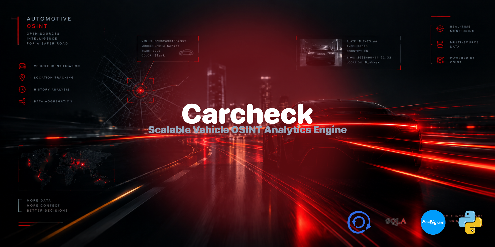

<p align="center">
  
</p>

<div align="center">

# 🚗 CarCheck (OSINT Analytics Engine)

</div>

An advanced, high-performance asynchronous Telegram bot engineered for vehicle history aggregation and automated OSINT data tracking via license plates and 17-digit VIN codes. Built from the ground up using **Aiogram** and **SQLAlchemy 2.0**, this platform implements the *Strategy Pattern* to achieve a completely decoupled, multi-country scaling infrastructure.

<div align="center">

## 🚀 Key Architectural Features & Capabilities

</div>

* **Scalable Multi-Country Provider Strategy:** Built following the Open-Closed Principle (SOLID). The current operational core includes a fully functioning **KG (Kyrgyzstan) Provider** handling modern formats (`01KG111AAA`) and legacy layouts (`B5555BA`). New regional strategies can be implemented independently in clicks without affecting core handlers.
* **Pure Asynchronous Data Pipeline:** Powered entirely by non-blocking operations via `asyncio`. The integration of **SQLAlchemy 2.0** and **aiosqlite** delivers lightning-fast, concurrent user telemetry registration without thread-blocking issues.
* **Unified Vehicle Report Framework:** Incorporates structured mock data modules and background parsers designed to demonstrate enterprise API contract structures and complex JSON-payload normalization during technical evaluations.
* **Production-Grade Code Discipline:** Adheres strictly to PEP 8 standards, modular folder structuring, centralized configuration mapping, and clean environment variable encapsulation (`python-dotenv`).

<div align="center">

## 📦 Local Deployment & Verification

</div>

1. Clone the repository and enter the workspace directory:
   ```bash
   git clone https://github.com/Hades-db/Carcheck
   cd Carcheck
   ```
2. Deploy the asynchronous software environment:
   ```bash
   pip install -r requirements.txt
   ```
3. Initialize configuration settings in a root `.env` file:
   ```env
   TOKEN=YOUR_TELEGRAM_BOT_TOKEN
   ```
4. Fire up the core application engine:
   ```bash
   python main.py
   ```
